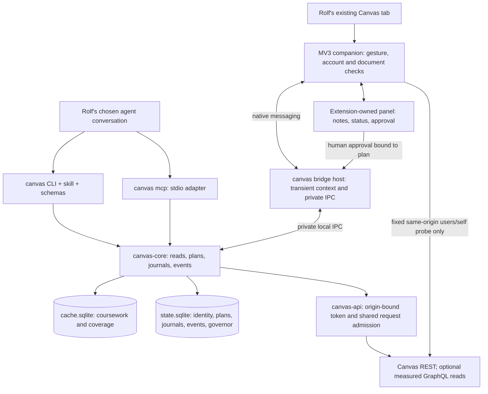

# Agent-first Canvas: agreed design

Date: 2026-09-09. Authors: fable and gpt. Consensus: [turn 05](turns/05-fable.md) and [turn 06](turns/06-gpt.md). Report author: gpt. Final peer review: pending.

This is a post-M5 design, based on [SPEC v0.8](../SPEC.md), especially §§0–5, 7, 12.2, 13, and 18. It does not amend v1 or claim implementation, performance measurements, client interoperability, or authenticated Lasell testing. Bracketed source identifiers refer to §6.

## 1. Answer for Rolf

Make `canvas-cli` the shared coursework engine for whichever agent you use: quick structured reads, accessible course material, downloads, and submissions with a durable record. Give shell agents the CLI and a small skill; give local MCP hosts `canvas mcp`. For “come with me,” attach your existing Canvas tab to the conversation you choose. A thin companion supplies your location and selected passage, displays the agent's notes and submission status, and asks you to approve the exact work before sending it. Keep factual coursework reads and writes on the API path; use the browser for presentation and supported handoffs. Existing Claude and OpenAI browser integrations already provide useful in-place assistance, so use them with the CLI before building another browser controller. The new companion earns its place through portable context, account checks, and operation receipts. “Single interaction” means one conversation coordinating these surfaces; quizzes and unsupported external tools still require your direct participation. [S1–S3]

## 2. Options considered

Effort is relative engineering scope. Latencies below are targets or qualitative dependencies, never measurements from this dialogue.

| Option | Latency | Safety and authority | Effort | Enables | What breaks or remains missing |
|---|---|---|---|---|---|
| CLI JSON + skill + `canvas schema` | Existing §13 process/cache targets; network on misses | Existing identity, containment, journal; unrestricted shell can bypass adapter policy | Low | Any shell agent can organize coursework now that the commands exist | Shell execution needed; no automatic tab attachment |
| `canvas mcp` over stdio | Target warm bounded reads p95 <100 ms | Curated tools and bound human approval; one identity generation per instance | Medium | Structured tools/resources in local hosts without giving the model a shell | Version/elicitation differences; cloud-only clients cannot directly reach local stdio |
| Thin MV3 companion + native host | Target metadata read p95 <100 ms; account check and page loading separate | User gesture, exact origin, verified account, selected consumers, bounded text | Medium–high | Follow the actual tab, share selected context, show notes/plans/receipts | Extension installation and lifecycle; opaque external frames; no generic clicks |
| Existing Claude/OpenAI browser integration + CLI | Host/tool/model dependent; unmeasured | Vendor site permissions; browser actions are outside our submission adapter guarantee | Low integration effort | Logged-in interaction and an existing conversational surface | Availability varies; portable attachment/receipt contracts need explicit integration |
| CDP attached to existing Chrome | Connection consent plus browser/tool latency | Broad debugging access to a real session; separate authorization | Medium | Inspect live DOM and debug unsupported workflows | Consent/banner, profile and target selection; no built-in Canvas journal |
| Separate Playwright/CDP profile | Browser startup/login plus page loading | Isolation from personal profile, but another powerful session | Medium | Reproducible fixtures and browser testing | Does not automatically share Rolf's current login, selection, or unsaved work |
| `canvas open` with optional follow | Local dispatch; target follow acknowledgement p95 <300 ms | Validate origin/target; navigation may have normal Canvas side effects | Low | Reliable handoff and navigation from a conversation | No context or presence by itself |
| Cookie import or arbitrary browser-session API proxy | Unmeasured; little benefit with a working PAT | Additional credential and write channel | High maintenance | Token-less automation in some environments | Excluded; undermines one operation path and exceeds the narrow companion need |

Chrome 136 restricts old remote-debugging flags on the default profile; this does not make existing-profile automation impossible. Chrome's documented 144+ `--autoConnect` flow requests consent for each connection and displays an automation banner. [S4, S5] OpenAI documents tab mentions, selected text, side chat in supported browsers, and signed-in interaction; Claude documents integration with Chrome. Neither is assumed to require screenshots for every action or to be unable to use our CLI. Their capabilities do not establish our custom contracts. [S2, S3]

Prior art includes an existing Go Canvas CLI with MCP support. MCP availability alone is not the project's distinction; the student workflow, complete cache metadata, and recoverable writes are. Stars, response times, and feature percentages in the older research file are not treated as fresh measurements. [S1]

## 3. Recommended architecture and contracts

### 3.1 Shared core, two kinds of context

Keep the v1 separation of `canvas-api`, `canvas-core`, and CLI rendering. Extract reusable schemas and request handlers for the MCP adapter rather than invoking shell commands or copying submission logic. Cache/state open without unlocking credentials until a network operation needs them. All new database work follows §10 locking and migrations.

The API supplies assignment facts, effective dates, rubric information, grades, and availability. The browser supplies location, selection, and explicitly requested transient presentation. `ContextBundle@1` separates `api` envelopes with freshness/coverage from `browser` observations with account verification time, document generation, truncation, and expiry. A browser extract never updates authoritative API fields. Canvas source exposes assignment/course IDs to its page environment, but these remain hints; Chrome isolated content scripts cannot directly read page JavaScript globals. [S6, S7]

The CLI/broker operate locally and add no telemetry or intermediary service. A chosen cloud agent still receives the context explicitly shared with it; local execution does not mean the model runs locally.

### 3.2 Agent-facing surface

All names here are proposed post-M5 contracts. Existing v1 commands and their one-document `--json` output remain as specified.

| Surface | Inputs and result | Effect and admission |
|---|---|---|
| `canvas schema <command>` and shipped agent skill | Versioned schemas, short workflows, error/recovery instructions | Local; no token or API request |
| `canvas mcp` | Stdio; startup profile pins identity key and generation | Curated adapter; identity replacement stops the instance |
| Coursework tools | `courses.list`, `course.get`, `todo.list`, `assignments.list`, `assignment.get`, `grades.get`, `files.list`, `modules.list`, `announcements.list`, `announcement.get`, `calendar.list`, `submission.get`, `receipts.list`, `receipts.show` | Preserve corresponding v1 arguments and §7 results; no confirmation for authorized reads |
| Organization tools | `sync.run`, `download.plan`, `download.run` | Configured destination only; no force/unmanaged overwrite; preserve coverage and per-file outcomes |
| Submission tools | `submission.prepare(target,payload)`, `submission.execute(plan_id)`, `submission.reconcile(journal_id, assume_not_submitted=false)` | Prepare writes a local plan; execute needs bound approval; ordinary reconciliation never posts |
| Evidence retirement | `receipts.acknowledge(journal_id)`; explicit assume-not-submitted reconciliation | Exact journal and consequence approved; preserve the v1 time/evidence conditions |
| Location and routing | `context.attach(attachment_id)`, `context.here(attachment_id, include_text=false)`, `context.detach(attachment_id)` | Explicit consumer attachment; no implicit sharing from resource subscriptions |
| Presence | `context.note(attachment_id,generation,text,source_refs)` | Bounded inert note; no Canvas edit; cannot approve a plan |
| Navigation | `open.url(target)`; `context.follow(attachment_id,generation,target)` | First resolves only; second navigates within the granted origin and rejects obsolete generations |
| CLI companion | `canvas here [--attachment ID] [--text] --json`; `canvas open ... --follow`; `canvas bridge install|host|status|detach` | Sole attachment may be selected by CLI; installation/status are human setup, not general model tools |
| Watch | `canvas watch --jsonl [--since CURSOR]`; later `canvas notify` | Versioned events with replay; desktop alerts consume events, not a new data source |

Credentials, token reveal, identity administration, arbitrary HTTP/shell, generic DOM actions, `--yes`, cache clearing, and `download --force` are absent from the MCP tool catalog. Annotations describe effects rather than command classes: `submission.prepare`, reconciliation with durable changes, downloads, and navigation are not pure reads. Tool hints never substitute for enforcement. New operation tools use schemas such as `canvas-cli/plan@1`; the normal envelope retains identity, requests, partial results, warnings, outcome, and exit. Domain failures preserve the envelope in `structuredContent` and serialized text; protocol/argument failures use the appropriate MCP error. Output schemas must admit both success and domain-error shapes. [SPEC §§5, 7, 14; S8]

Resources are namespaced by identity **and generation**, with canonical encoding: `canvas://<identity-key>/<generation>/todo`, `/course/<id>/assignments`, `/receipts`, and `/context/<consumer-handle>`. Consumer handles express routing within Rolf's OS trust domain, not isolation from another unrestricted process. Context resources return `not_attached` until attachment is explicit. No tool/resource discovery leaks another consumer's text. Results that carry private data use `cacheScope: private`; `ttlMs` is no greater than remaining relevant freshness and is zero for browser context or unresolved/invalidated values. §7 coverage remains authoritative. [S9]

**Protocol target:** `2026-07-28`, including `server/discover`, per-request version/capabilities, and `subscriptions/listen`. Elicitation is an `input_required` result with a keyed input request; the host retries the tool with a new JSON-RPC request ID, echoed `requestState`, and keyed `inputResponses`. `2025-11-25` requires an explicit lifecycle/elicitation/subscription adapter. An unsupported version fails explicitly. [S8–S11]

| Host | Required release evidence | Established in this dialogue |
|---|---|---|
| Claude Code | Actual version, negotiated MCP revision, structured/error results, accept/decline/cancel, replay, subscriptions | Product documentation only; custom adapter untested |
| Codex | Same, including the actual host's human approval channel | Product documentation only; custom adapter untested |
| Cursor | Same; graceful behavior for unsupported features | No custom adapter interoperability run |

A host without a proven approval UI may use the extension-owned panel or TTY. Otherwise return a domain `approval_required` refusal with the plan handle; do not dispatch. Stdio is the first release transport. Remote HTTP, cloud-only access, and vendor-specific conversation injection require separately designed integrations, not an unauthenticated localhost endpoint.

### 3.3 “Come with me,” step by step

1. Rolf opens a Canvas tab and invokes the companion through its toolbar button or shortcut. `activeTab` grants access from this gesture. Select the conversation/consumer; the panel shows it. Same-origin navigation preserves the grant. [S12]
2. The extension validates the browser-reported origin and document/frame identifiers, classifies the route, and performs a fixed same-origin `GET /api/v1/users/self` in extension-owned isolated code with redirects refused. Its user ID must equal the CLI identity. Cookies stay in Chrome. This is the sole proposed browser-session API exception; there is no cookie import or arbitrary fetch proxy.
3. Create one active attachment per identity, bound to browser-profile instance, tab, origin, account, identity generation, and a changing navigation generation. Account mismatch or inability to verify prevents joining API and browser content. No credentials or login page text enter a bundle.
4. `context.attach` opts the chosen consumer in. `context.here` resolves IDs through the API and returns API facts separately from bounded browser context. A selected passage or unsaved editor excerpt is supplied only on request, after another account check. Metadata-only cached reads do not wait for model generation. The UI may offer explicit sharing with another consumer; subscriptions alone never do so.
5. The agent answers in its existing conversation and can send `context.note` to the panel. Show source links, freshness, pending journals, and receipts. Notes are inert text/sanitized markup, never page-executed HTML or commands. No model or chat backend is built into the companion.
6. A new document enters `validating`; erase old text, recheck account/zone, and reject late document-generation messages. Cross-origin navigation revokes access; returning requires a new gesture. Account change requires rebinding. Tab closure, detach, host loss, assessment entry, or configured hidden-tab timeout pauses/ends sharing. Assessment/external/unknown frames remain opaque.
7. For a requested submission, prepare and show the exact plan, collect approval through a supported channel, dispatch through the common journal, and display its actual state. Follow navigation is explicit and separately annotated: it can trigger normal page side effects. Canvas's page-display controller changes discussion read state, so API preview guarantees do not extend to ordinary navigation. [S13]

`ContextBundle@1` carries attachment/state/consumer, identity generation, an `api` section containing typed §7 envelopes, and a `browser` section containing origin, verified-account observation, page kind/IDs, sanitized URL/title, frame and navigation generation, zone, observation time, TTL, and optional selection/text with lengths and truncation. Default browser payload ceiling: 64 KiB UTF-8 total, preserving character boundaries. Return metadata and an explicit reason when content is unavailable; never recycle text from an earlier page.

Classify **before** extracting text. Prefer known routes and authenticated API metadata; optional MAIN-world `ENV` extraction is an untrusted hint. Exclude hidden inputs and credential fields, remove capability-bearing URL parameters, and use allowlisted text fields. Unknown frames are not searched for clues by first reading their contents. This cannot prove that arbitrary prose contains no secret; explicit selection and minimization remain important design limits. Erasing broker buffers cannot retract context already delivered to a host or model.

### 3.4 Native host and lifecycle

`canvas bridge host` speaks Chrome's length-prefixed native-messaging JSON; it is distinct from MCP stdio. The host manifest allows exact extension IDs; Canvas origins are checked separately. A private broker endpoint uses a `0700` directory and `0600` Unix socket, or a Windows named pipe with user-restricted ACLs. No global `here.json`, no public port, and no browser credentials persisted. Native-message size limits exceed the proposed bounded context, but enforce limits before allocation. [S14]

Elect a single broker owner per identity; a second browser profile/host cannot silently replace its attachment. Use explicit handoff or report an existing owner. Reconnects invalidate old document state and require validation. Installation includes the native manifest and extension; the binary alone cannot grant browser permissions. The side panel is an extension-owned surface, not a Canvas DOM overlay. [S14, S15]

Resident bridge, MCP, and watch consumers hold identity leases/locks while using the identity. Identity removal requests cooperative release from **all** resident consumers, then follows §10's exclusive-lock protocol. A refusal/timeout reports busy; never kill unrelated processes, delete live lock files, or reopen a removed identity. Existing read-only invocations remain read-only.

### 3.5 Confirmation and durable operations

| Decision | Examples | Rule |
|---|---|---|
| Authorized read | Coursework preview, receipts, attached context | No repeated confirmation |
| Authorized local organization | Sync, bounded downloads, local notes, prepare | No repeated confirmation; existing containment applies |
| Remote write | Submission; later inbox send/discussion reply | Human approval bound to exact content, target, and operation |
| Evidence retirement | Acknowledge unknown outcome; assume not submitted | Explicit human decision tied to that journal |
| Outside agent surface | Credentials, identity removal, force overwrite | Human CLI/setup only |

`submission.prepare` freezes exact text/HTML bytes and input/sent digests, file names/sizes/hashes, URL/comment, course/assignment, identity generation, baseline submission/attempt, and meaningful eligibility/due-date observations. Store a `plan@1` row with a proposed 15-minute admission expiry. Preparing does not upload or post and never holds an admission lock across human consideration. The plan state is `prepared | approved | executed | expired | invalidated`; `executed` means journal-linked, not successful submission.

The approval request binds a random server-issued handle to plan digest, identity, consumer, and expiry. The **host's human-response path** or private panel/TTY event provides approval. Echoing a handle, digest, or boolean is not proof of human participation. MCP returns the handle through `requestState`; keyed `inputResponses` supplies accept/decline/cancel. Ordinary model tool arguments cannot assert approval. [S8, S10]

At execute, acquire assignment admission, revalidate the target, account generation, baseline attempt/submission ID, allowed kinds/extensions/group restrictions, dates, and eligibility; changed meaningful facts require a fresh plan/approval. Check all existing §12.2 conditions, including extra attempts and hash verification. Under the owner/admission locks, one state transaction consumes approval, links the unique plan to a journal, and marks the plan executed. Uploads begin only after it commits. Streamed file hashing remains mandatory. A concurrent execute, restarted host, or replayed acceptance returns the existing journal; it never creates another attempt for that plan.

After a POST is dispatched, retain §12.2's conservative uncertainty, owner-absent recovery, reconciliation, and observed/unproven attribution. No automatic repost follows a lost response. `reconcile` without an assumption never posts and needs no additional approval. Cancellation after dispatch reports the journal, not “nothing submitted.” Expiry prevents first admission, not later status queries. Human `canvas submit` retains its single-flow interaction; CLI-only `--yes` is recorded honestly and is not exposed by the supported agent adapters.

PAT scope enforcement depends on the institution's developer-key settings; an unscoped token inherits the user's permissions. Do not claim the token itself removes quiz or write capabilities. Multi-user distribution requires OAuth under Canvas documentation. [S16, S17] The approval guarantee covers supported adapters; unrestricted shell, credentials, another controller, or a malicious same-user process can bypass it.

Assessment zones are `open | graded | assessment | external | unknown`. Quizzes, active assessments, and unidentified embedded tools expose no questions, answers, or unsaved assessment content through the companion. Graded coursework/discussions may expose authorized context, but approval to post is not permission for AI-generated academic work: use the instructor's course policy to govern assistance. Never create placeholder replies to bypass initial-post restrictions. Keep group writes deferred, including group discussion replies. Canvas exposes both graded discussions and initial-post restrictions. [S18]

### 3.6 Watch, coordination, events, and latency

Use staggered dataset refreshes based on configured TTLs, with backoff and manual freshness controls. Activity-summary/unread counts can prioritize checks, but unchanged counts cannot prove deadlines or content unchanged. Live Events are a separate institutional integration and are explicitly unsuitable as a guarantee of immediately current state in Canvas documentation; the student client relies on normal API reads. [S19, S20]

All CLI/MCP/watch network work uses one **logical per-identity coordinator**, implemented initially with shared state and cross-platform file permits rather than an additional daemon. Per-dataset/scope locks suppress duplicate refreshes. Global permits cap concurrent requests across processes. A state transaction reserves request cost before dispatch; responses update conservative shared estimates, request-order watermarks, cooldowns, and refill state. Recover vanished owners without resetting to an invented full bucket. Apply storage limits separately. No network wait occurs inside a database transaction.

Register foreground submission interest before its first preflight request. Stop admitting new polling work while higher-priority work waits; an already-running request may finish. Limiting watch to one slot is insufficient to promise zero wait, especially at concurrency one. Test bounded priority and eventual polling progress. A terminal `outcome_unknown` journal does not freeze polling forever: readback/reconciliation must continue. Refresh waiters time out at 30 seconds; return existing coverage with honest stale/partial metadata, or the normal miss/error when nothing usable exists.

`canvas-cli/event@1` contains `cursor`, `kind`, `observed_at`, identity/generation, dataset/scope, entity key, and per-kind allowlisted before/after fields. Kinds include assignment added/changed/removed, due changed, grade changed/posted, announcement new, missing new, submission state, inbox unread count, and `resync_required`. Do not store full messages, DOM captures, tokens, or signed URLs in events.

Maintain the event cursor, comparison baseline, and deduplication key together in `state.sqlite`; journal events commit with journal transitions. For cache observations use a unique durable observation ID, not time alone. Cache commits and state events are not one transaction: preserve an outbox/observation record for replay, or detect an overwritten observation and emit an explicit gap requiring resync. A restart cannot silently pretend the gap did not happen. First complete observation establishes a baseline. Compare only the same complete scope/window; `removed` means absent from that membership. Failed pages never imply deletion. `grade.posted` needs publication evidence; otherwise emit `grade.changed`.

Proposed retention is 30 days. Replay is at least once; consumers deduplicate cursors. An expired or wrong-generation cursor requires resync. Desktop alerts are deduplicated derived events; event subscriptions are hints, not guaranteed agent wake-ups. Remote transitions between polls may never be observed. Streaming has its own `--jsonl` contract and does not alter §7's single-document `--json` rule.

| Path | Acceptance target or boundary |
|---|---|
| Existing cached CLI `todo` | Preserve §13: first output p50 <50 ms/p95 <150 ms; complete p95 <250 ms; cold-page-cache p95 <400 ms |
| Warm bounded MCP read / broker metadata | Proposed p95 <100 ms, excluding model generation and new account probe |
| Follow | Proposed dispatch acknowledgement p95 <300 ms; report loaded/failed separately |
| Fresh API read/account check | Network dependent; report timing and actual requests; no cached-speed promise |
| Sync/download/submit | Progress and durable status; duration depends on pagination, bytes, network, and human decision |
| Watch | Dataset TTL plus backoff; no universal 60-second freshness guarantee |

Measure fixture size, process startup, schema tokens, payload bytes, tool calls per workflow, p50/p95 timings, API costs, and contention with an active download. Use bounded context projections for large responses with explicit truncation/coverage; never label a truncated list complete. Cache speed alone does not establish a fast end-to-end model interaction.

## 4. Additions to SPEC §18 after M5

These are proposed packages for the coordinator to integrate after the current v1 work. All M5 packages and existing gates remain prerequisites; implementation is not authorized by this report. Assign owners for command enum, schema registry, migrations, and new extension interfaces before parallel work.

| Package | Owns / depends on | Acceptance criteria |
|---|---|---|
| **M6-a: operation plans and approval core** | Core plan/approval state, journal linkage, human submit refactor; depends on M5 | Preserve all §12.2 tests; concurrent execute/replay creates one journal; kill before/after atomic approval-link transaction; changed bytes/identity/eligibility rejected; no lock during approval wait; unknown POST never auto-reposted; exact body/hash visible in plan |
| **M6-b: agent adapters, schemas, skill** | Reusable contracts, `canvas mcp`, `canvas schema`, skill; M6-a | Snapshot successful/error envelopes against CLI; exclude forbidden tools/flags; test both declared MCP versions or explicit refusal; publish real Claude Code/Codex/Cursor compatibility matrix; accept/decline/cancel/replay; no-elicitation refusal; private identity-generation resources; measure schema tokens and warm latency |
| **M6-c: shared coordinator and watch/notify** | Cross-process permits/governor, observation recovery, events/JSONL, optional desktop notifications; M6-b | Combined CLI/MCP/watch caps; owner death/cooldown recovery; concurrency-one priority and starvation; same-scope single-flight; partial page emits no removals; first baseline silent; crash across cache/state handoff yields replay or resync; retention/cursor dedup; unknown journal does not halt readback |
| **M7-a: companion attachment and broker** | MV3 extension, native host/install, IPC, `here`, account probe, consumer routing; M6-b/M6-c | Real Chrome gesture and same-origin navigation; cross-origin revocation; two tabs/profiles/consumers; account switch; stale document messages; exact extension/origin checks; failed/redirected identity probe; no capture before zone classification; no secrets/cookie files; byte bounds; broker restart and identity removal |
| **M7-b: presence, panel approvals, follow** | Notes/status/receipts panel, `context.note`, follow, private approval events; M7-a/M6-a | Display existing agent's note without a model backend; inert malicious markup; generation-bound notes/navigation; exact plan approve/decline; no page-forged approval; observed/unknown receipt states distinct; follow acknowledgement separated from load; API preview and browser read-state side effects distinguished |
| **M8-a: richer reading context** | Pages/page, syllabus, accessible rubric extension, discussions and inbox reads; M6-b/M6-c, independent of M7 | Explicit schemas/coverage; permission and initial-post failures; paginated replies; graded/group metadata; inbox requests set `auto_mark_as_read=false`; API previews do not mutate unread state; unavailable embedded content reported; file references preserve origin and containment |
| **M8-b: discussion and inbox writes** | Per-operation prepare/execute/status/reconcile and attribution; M8-a/M6-a/M6-b | Exact recipients/thread/body/attachments frozen; trusted approval; group writes refused; no placeholder unlock; ambiguous timeout never resent automatically; distinguish accepted request, observed object, and unattributed matching content; no claim of email delivery from an API acceptance |
| **M8-c: measured GraphQL option** | Fixed read queries/adapters and benchmarks; M5-a/M8-a | Compare identical workloads/coverage to REST; paginate every connection; map `_id`; preserve nulls, permission failures, partial errors, request costs; adopt only for a measured benefit without changing output semantics |
| **M8-d: conditional OAuth distribution gate** | Native OAuth and institutional developer-key onboarding; before multi-user release | Demonstrate supported institutional flow, scopes, identity binding, token rotation/revocation, secure storage, and refusal to send credentials across origins; no request for other students to paste manual PATs; existing personal setup remains available |

Pages/inbox/discussion reads can proceed after M6 without waiting for the companion. M8-d is mandatory only when distributing for other users. GraphQL is optional and cannot delay the reliable REST path.

**Other Canvas capabilities and explicit v2 changes:**

| Capability / v1 non-goal | Decision and reason |
|---|---|
| No GUI/browser automation | Lift narrowly after M5 for attachment, notes, approval, and follow; generic clicking remains a separate fallback |
| No cookie import | Keep; permit only the extension-owned account probe, with cookies confined to Chrome |
| No OAuth in v1 | Lift conditionally for multi-user distribution; institution support remains a prerequisite [S17] |
| No GraphQL in v1 | Benchmark fixed read queries later; GraphQL has REST-aligned permissions, incomplete coverage, different global IDs, and cursor pagination [S21] |
| Inbox/discussions deferred | Add reads, then planned writes; discussions can be graded and initial-post-gated [S18, S22] |
| Notifications | `notify` consumes durable events; optionally read channel preferences. Changing remote notification settings is a separately approved write [S23] |
| ICS feeds | Keep v1 generated ICS. Do not import/persist secret feed URLs or promise external calendar refresh timing; direct API/cache facts drive the agent [SPEC §12.5] |
| Quiz taking, teacher/TA/admin tools, group submissions | Keep excluded in proposed v2. Quiz metadata can remain in todo with direct human browser handoff |
| LTI | Keep ordinary browser handoff. No launch-token extraction, iframe scraping, or generic graded-tool automation; extensions need explicit future contracts |
| Student mobile deep links | Low desktop value. Keep canonical HTTPS links; add a mobile adapter only after validating routes against the official apps. Scheme support on Rolf's phone is not established [S24] |
| Canvas Studio | Official API documentation exists, including media and captions. Defer until student permissions, account setup, and Lasell availability are verified; never infer Studio access from a Canvas PAT [S25] |
| Local grade estimation | Separate v2 project under §12.4; not needed for this agent surface |

## 5. Risks and open questions for Rolf

**Lasell origin.** SPEC records the owner's working PAT at `lasell.instructure.com`. Lasell's public login page links students to `courses.lasell.edu` and medical-science users to a separate host. That does not prove an equivalent final authenticated origin. Verify the actual final tab URL and account at setup; never silently alias origins or forward tokens to a vanity domain. No authenticated account check was performed in this review. [SPEC §0; S26]

**Host reachability and consumer handoff.** The chosen agent must be able to run local CLI/MCP tools. Some browser conversations may need additional host integration to select/identify the same consumer. Publish only tested workflows; do not claim universal conversation injection. A cloud-only agent needs an independently authorized remote transport.

**Policy and unfamiliar course tools.** Which courses allow drafting or other AI assistance, and which embedded tools appear in Rolf's actual courses? Until classified, assessment/external/unknown content stays opaque. This policy boundary is not enforced against a separate unrestricted agent/controller.

**User-visible preferences.** Confirm the default consumer, optional sharing, hidden-tab pause duration, event retention/desktop notification scope, and download destination during setup. The proposed defaults do not require reopening already-authorized ordinary reads. OAuth developer-key access is the substantive question before distribution.

**Operational limits.** Browser updates, native-host packaging, missed polling transitions, stale caches, and API failures remain possible. Handle them through explicit unavailable/partial/unknown states and replay; a local receipt is an integrity record, not a server-signed guarantee of deadline compliance. API documentation and the inspected upstream source snapshot do not establish Lasell's deployed version or enabled features. A later implementation must test actual behavior.

## 6. Sources and evidence

Official pages below were read during the dialogue/report work; access date 2026-09-09. Canvas source inspection used commit `1c9f0bb8013ed69c4f2efe11fd483025469b7e6c` returned by the public repository API (commit date 2026-04-30). It is an inspected upstream snapshot, not a claim about Lasell deployment. Design choices and acceptance targets are our proposals.

- **SPEC:** [Specification v0.8](../SPEC.md), §§0–5, 7–13, 15–18; [prior-art research](../research/r2-prior-art.md) used as a discovery index, not fresh verification of every claim.
- **S1:** [Existing Go Canvas CLI](https://github.com/jjuanrivvera/canvas-cli), feature/prior-art comparison.
- **S2:** [OpenAI browser extension documentation](https://learn.chatgpt.com/docs/chrome-extension), signed-in interaction, tab/selection context, side chat, desktop/Codex entry points and availability limits.
- **S3:** [Claude Code with Chrome](https://code.claude.com/docs/en/chrome), browser integration, native-host setup, troubleshooting and permissions.
- **S4:** [Chrome 136 remote-debugging change](https://developer.chrome.com/blog/remote-debugging-port).
- **S5:** [Chrome DevTools MCP existing-session connection](https://developer.chrome.com/blog/chrome-devtools-mcp-debug-your-browser-session), Chrome 144+ and `--autoConnect`.
- **S6:** [Canvas assignment controller, pinned source](https://github.com/instructure/canvas-lms/blob/1c9f0bb8013ed69c4f2efe11fd483025469b7e6c/app/controllers/assignments_controller.rb#L251), page-environment IDs.
- **S7:** [Chrome content scripts](https://developer.chrome.com/docs/extensions/develop/concepts/content-scripts), isolated worlds and injection.
- **S8:** [MCP tools, 2026-07-28](https://modelcontextprotocol.io/specification/2026-07-28/server/tools), schemas, structured results, input-required retry shape and tool semantics.
- **S9:** [MCP 2026-07-28 changes](https://modelcontextprotocol.io/specification/2026-07-28/changelog), discovery, per-request metadata, subscriptions, cache scope/TTL.
- **S10:** [MCP elicitation](https://modelcontextprotocol.io/specification/2026-07-28/client/elicitation) and [multi-round-trip requests](https://modelcontextprotocol.io/specification/2026-07-28/basic/patterns/mrtr), human interaction and request state.
- **S11:** [MCP 2025-11-25 lifecycle](https://modelcontextprotocol.io/specification/2025-11-25/basic/lifecycle), compatibility adapter baseline.
- **S12:** [Chrome activeTab permission](https://developer.chrome.com/docs/extensions/develop/concepts/activeTab), gesture, same-origin navigation, revocation.
- **S13:** [Canvas discussion page controller, pinned source](https://github.com/instructure/canvas-lms/blob/1c9f0bb8013ed69c4f2efe11fd483025469b7e6c/app/controllers/discussion_topics_controller.rb#L796), read-state side effect.
- **S14:** [Chrome native messaging](https://developer.chrome.com/docs/extensions/develop/concepts/native-messaging), host manifests, framing, allowed origins and limits.
- **S15:** [Chrome sidePanel API](https://developer.chrome.com/docs/extensions/reference/api/sidePanel).
- **S16:** [Canvas access tokens](https://canvas.instructure.com/doc/api/access_tokens.html), optional scope enforcement dependent on developer-key configuration.
- **S17:** [Canvas OAuth documentation](https://canvas.instructure.com/doc/api/file.oauth.html), multi-user requirement, institutional developer keys and token storage.
- **S18:** [Canvas discussion API](https://canvas.instructure.com/doc/api/discussion_topics.html), assignments, groups, initial-post gate, cached view and pagination.
- **S19:** [Canvas users API](https://canvas.instructure.com/doc/api/users.html), current-user/activity-stream surfaces.
- **S20:** [Canvas Live Events introduction](https://canvas.instructure.com/doc/api/file.data_service_introduction.html), delivery model and freshness limitation.
- **S21:** [Canvas GraphQL](https://developerdocs.instructure.com/services/canvas/basics/file.graphql), permissions, coverage, `_id`, pagination.
- **S22:** [Canvas conversations API](https://canvas.instructure.com/doc/api/conversations.html) and [pinned conversation controller](https://github.com/instructure/canvas-lms/blob/1c9f0bb8013ed69c4f2efe11fd483025469b7e6c/app/controllers/conversations_controller.rb#L673), auto-read and mutation paths.
- **S23:** [Canvas notification preferences API](https://canvas.instructure.com/doc/api/notification_preferences.html).
- **S24:** [Official Canvas iOS apps](https://github.com/instructure/canvas-ios), mobile-adapter investigation entry point; no mobile runtime test performed.
- **S25:** [Official Canvas Studio documentation](https://developerdocs.instructure.com/services/studio), published media/caption API references; student access unverified.
- **S26:** [Lasell Canvas login](https://www.lasell.edu/academics/canvas-login.html), public login destinations only.
